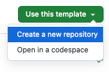

# Adım 1: Depo Yapılandırma

## **Adım 1.1: Şablon Depoya Gidin**

Başlamak için aşağıdaki şablon depoyu ziyaret edin:

[Proje Şablonu](https://github.com/keyvanarasteh/Project)

## **Adım 1.2: Şablonu Kullanarak Yeni Depo Oluşturun**

1. Şablon deposu sayfasının sağ üst köşesinde bulunan **Use this template** butonuna tıklayın.  
2. Açılan menüden **Create a new repository** seçeneğini seçin.

<div align="center">

</div>

## **Adım 1.3: Depo Detaylarını Yapılandırın**

1. Yeni deponuza bir **isim** verin (örneğin, projem).  
2. İsteğe bağlı olarak bir **açıklama** ekleyin.  
3. Deponuzun **görünürlüğünü** seçin:  
   * **Public:** Herkes tarafından görülebilir.  
   * **Private:** Sadece sizin ve erişim izni verdiğiniz kişilerin görebileceği şekilde ayarlanır.  
4. İsterseniz, depoyu bir README dosyasıyla başlatmak için ilgili kutucuğu işaretleyin.  
5. Son olarak, **Create repository** butonuna tıklayın.

## **Video Rehber**

Daha fazla detay ve görsel anlatım için aşağıdaki eğitim videosunu izleyebilirsiniz:

[Eğitim Videosunu İzle](https://youtu.be/CjhOSFO38V4)

# Adım 2: Takım Üyelerini Davet Etme

Deponuz için temel ayarları yaptıktan sonra veya projenizin herhangi bir aşamasında takım arkadaşlarınızı davet edebilirsiniz.

1. GitHub deponuzun ana sayfasına gidin.

2. Depo adının altında yer alan sekmelerden Settings (Ayarlar) seçeneğine tıklayın.


3. Sol taraftaki menüden Collaborators (İş Birlikçileri) başlığına tıklayın.


4. Sayfanın sağ tarafında bulunan yeşil renkli Add people (Kişi ekle) butonuna tıklayın.


5. Açılan modal pencerede, davet etmek istediğiniz kişinin GitHub kullanıcı adını, tam adını veya kayıtlı e-posta adresini arama kutusuna yazın.

6. Doğru kişiyi bulduğunuzda seçin. Varsayılan olarak 'Write' (Yazma) izni atanacaktır. Gerekirse bu izni değiştirebilirsiniz.

7. Add [kullanıcı_adı] to [depo_adı] (Örn: Add JaneDoe to my-awesome-project) butonuna tıklayarak daveti gönderin. Davet edilen kişi, kabul etmesi için bir e-posta bildirimi alacaktır.

### Bu adımla ilgili daha fazla bilgi için aşağıdaki videoyu izleyebilirsiniz:

[Eğitim Videosunu İzle](https://youtu.be/-AZ-h_ivXdc)


# Adım 3: README.MD dosyasini hazirlamak

README.MD dosyanızda aşağıdaki bilgileri düzenli bir şekilde liste halinde yazmanız gerekmektedir:

- Proje Adı
- Takım Üyeleri
- Açıklama
- Hedefler
- Bağlantılar

[Eğitim Videosunu İzle](https://youtu.be/Lc6JnRCWe4w)

# Adım 4: Generate Research Prompts

## 🚀 4.1: Gemini ile Derinlemesine Araştırma (Deep Research)

**Proje:** Projemizin Amaci Kullanimi 3-10 satir arasinda hazir olmasi lazim.

**Amaç:** Belirli bir alan (projemiz) için 2025 yılına ait en son ve en etkili ilk 10 tekniği veya trendi belirlemek.

**Neden Önemli?** Projenizin geleceğe yönelik ve yenilikçi olmasını sağlamak için en güncel bilgilere ve yaklaşımlara hakim olmak kritik öneme sahiptir.

**Prompt Hazırlarken Dikkat Edilmesi Gerekenler:**

1.  **Netlik ve Kapsam:** Araştırmanın hangi alanda yapılacağını açıkça belirtin (örneğin, "yapay zeka destekli siber güvenlik teknikleri", "sürdürülebilir enerji üretim teknolojileri", "web geliştirme framework'leri").
2.  **Zaman Aralığı:** "2025 yılı için" gibi net bir zaman aralığı belirtin.
3.  **İstenen Çıktı Formatı:** Sonuçların nasıl bir formatta istendiğini belirtmek faydalı olabilir (örneğin, "bir liste halinde", "her bir teknik için kısa bir açıklama ile birlikte").
4.  **Derinlik Seviyesi:** "Derinlemesine araştırma" veya "kapsamlı analiz" gibi ifadeler kullanarak istediğiniz detayın seviyesini vurgulayın.
5.  **Kaynak Güvenilirliği:** Mümkünse, güvenilir akademik makaleler, endüstri raporları veya uzman görüşleri gibi kaynaklara atıfta bulunulmasını isteyin.


[Eğitim Videosunu İzle (PART-01)](https://youtu.be/OMQTEeTQEng)

[Eğitim Videosunu İzle (PART-02)](https://youtu.be/Ox9cgd2DN7c)

[Eğitim Videosunu İzle (PART-03)](https://youtu.be/xnczyi3Bhq0)


**Örnek Gemini Deep Research Prompt'u:**

```text

**Proje ve Hedefler ve Ozellikler:** 

< Projemizin Ozet Aciklamasi >


**Görev:** 2025 yılı için [PROJE BASLIGIMIZ, örneğin: 'wireshark kullanarak yazilimcilari agda tesbit etmek (Yazilimci Avi)'] alanındaki en son ve en etkili ilk 10 tekniği/trendi derinlemesine araştır ve belirle.

**Ozellikler** 

**İstenen Çıktı Detayları:**
1.  Belirlenen her bir teknik/trend için kısa ve öz bir başlık.
2.  Her bir tekniğin/trendin ne olduğu, nasıl çalıştığı ve neden önemli olduğuna dair 2-3 cümlelik bir açıklama.
3.  Her bir tekniğin/trendin 2025'teki potansiyel etkileri ve uygulama alanları.
4.  Mümkünse, her bir teknik/trend için güvenilir bir kaynak veya referans (örneğin, yayın adı, konferans, uzman görüşü).
5.  Sonuçları numaralandırılmış bir liste halinde sun.

**Kısıtlamalar:**
- Sadece 2025 yılı ve sonrası için öngörülen veya geçerli olacak tekniklere odaklan.
- Bilgilerin güncel ve doğrulanabilir olmasına özen göster.
- Spekülatif olmayan, kanıta dayalı bilgiler sun.

**Örnek Alanlar (Projenize Göre Değiştirin):**
- Yazılım Geliştirme Metodolojileri
- Veri Bilimi ve Makine Öğrenimi Uygulamaları
- Blokzincir Teknolojileri
- Dijital Pazarlama Stratejileri
- İnsan-Bilgisayar Etkileşimi Arayüzleri
```


<!-- 

Step.3:

Create readme.md

Step.4:

Generate Research Prompts

Step.5:

Do Gemini Deep Search

Step.6: 

Commit research document to repository.

Step.7:

Generate roadmap.md

Step.9:

Commit roadmap to repository.

Step.10:

Start to implement roadmap steps... -->
